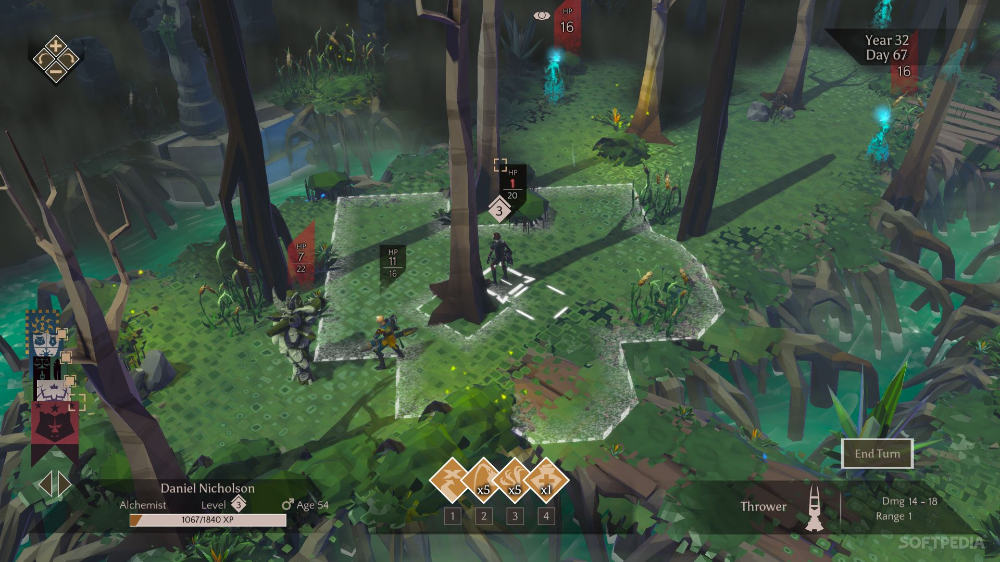
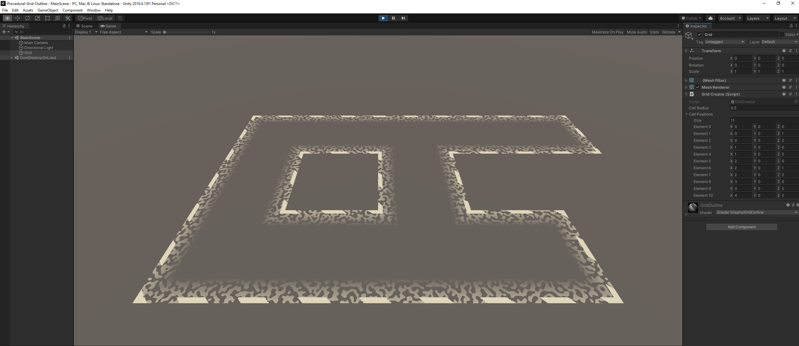
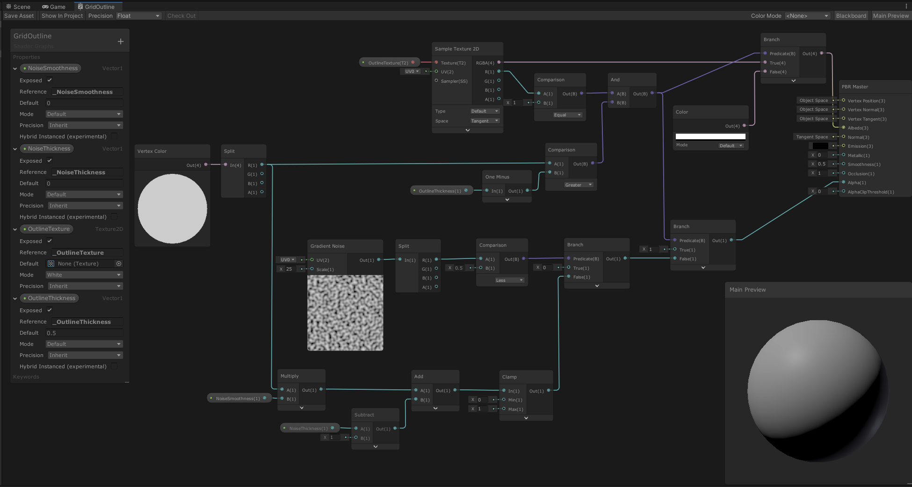

# Procedural Grid Outline
Recreating outline of procedurally generated grid from a “Massive Chalice” game.
The main idea is to colorize the vertices in the appropriate colors during mesh creation and then use this data in the shader.
 
__Original outline:__

 
__Recreated outline:__

 
__Shader Graph:__

